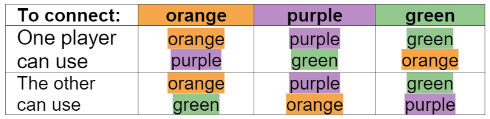

# TP1 PLOG - Alliances

## Group T2 Alliances_3

| Name                                      | Number    | E-Mail               |
| ----------------------------------------- | --------- | -------------------- |
| Adriana Cruz e Silva da Costa Gonçalves   | 201808911 | up201808911@fe.up.pt |
| José António Dantas Macedo                | 201705226 | up201705226@fe.up.pt |

---

## Game Description
Alliances, a 2-player game by Markus Hagenauer.
 
 
Alliances is a tricky game requires you to connect opposite sides of
the board.
 
To connect opposite sides of the board, 
each player must use the colour matching the sides and form an
uninterrupted chain of discs between those sides.
   
The chain of discs can also be formed by the allied colours, which is different for each player:
   

### Gameplay
Every turn a player take a disc from the supply and place it on any empty space on the board.  
If a connection is made between opposite sides,
with an uninterrupted chain of discs of the sides colour and/or the allied colour,
the player wins the colour of the connected sides.

### Goal
Win 2 colours. A player win a colour by being the first to connect its to sides of the board.

You can find a more explanation
[here](./pdf/ALLIANCES_EN.pdf)
or find it online: 
 
https://nestorgames.com/rulebooks/ALLIANCES_EN.pdf;
 
https://boardgamegeek.com/boardgame/302399/alliances;
 
*gameplay video:*
https://www.youtube.com/watch?v=VNyHiCfOWhw&feature=emb_logo.
 

 
*Fig. 1: Board of Alliances*

 
 

----
## Internal representation of the state of the game
 

The current state of the game is stored in a list of lists with differents lengths.  
The list represents the board, and the lists within that list represents the different lines of the board.  
The lines of the board have multiple atoms that represent the discs and the spaces of the board.  

Atoms meaning:

| Atom | Meaning                         |
| ---- | ------------------------------- |
|  X   | Empty space on the board        |
|  G   | Green Disc                      |
|  P   | Purple Disc                     |
|  O   | Orange Disc                     |

Current Player is represented by ... 
  
Exemple of representation of game states:
 
 
*Example of initial board:* 
initial_board([ 
    [X,X,X,X,X], 
    [X,X,X,X,X,X,X,X], 
    [X,X,X,X,X,X,X,X,X], 
    [X,X,X,X,X,X,X,X,X,X], 
    [X,X,X,X,X,X,X,X,X,X,X], 
    [X,X,X,X,X,X,X,X,X,X,X,X], 
    [X,X,X,X,X,X,X,X,X,X,X], 
    [X,X,X,X,X,X,X,X,X,X,X,X], 
    [X,X,X,X,X,X,X,X,X,X,X], 
    [X,X,X,X,X,X,X,X,X,X], 
    [X,X,X,X,X,X,X,X,X], 
    [X,X,X,X,X,X,X,X], 
    [X,X,X,X,X] 
]). 
   
*Example of intermediate board:* 
intermediate_board([ 
    [X,X,O,X,X], 
    [X,X,X,O,X,X,X,X], 
    [X,X,X,X,P,X,X,X,X], 
    [X,X,X,X,P,X,X,X,X,X], 
    [X,X,X,X,X,O,X,X,X,X,X], 
    [X,X,X,X,X,O,X,X,X,X,X,X], 
    [X,X,X,X,X,O,X,X,X,X,X], 
    [X,X,X,X,G,X,X,X,X,X,X,X], 
    [X,X,X,X,X,G,X,X,X,X,X], 
    [X,X,X,X,O,G,X,X,X,X], 
    [X,X,X,X,G,O,X,X,X], 
    [X,X,X,X,O,X,X,X], 
    [X,X,O,X,X] 
]). 
   
*Example of final board:* 
final_board([ 
    [X,X,O,X,X], 
    [X,X,X,O,X,X,X,X], 
    [X,X,X,X,P,O,X,X,X], 
    [X,X,X,X,P,O,X,X,X,X], 
    [X,X,X,X,X,O,X,X,X,X,X], 
    [X,X,X,X,X,O,X,X,X,X,X,X], 
    [X,X,X,X,P,O,X,X,X,X,X], 
    [X,X,X,P,G,X,X,X,X,X,X,X], 
    [X,X,X,X,P,G,X,X,X,X,X], 
    [X,X,X,X,O,G,X,X,X,X], 
    [X,X,X,X,G,O,X,X,X], 
    [X,X,X,X,O,X,X,X], 
    [X,X,O,X,X] 
]). 

-----
## Visualizing the game
 

 
