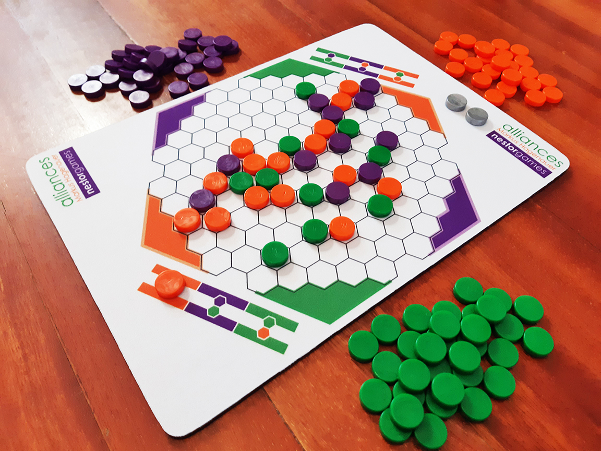
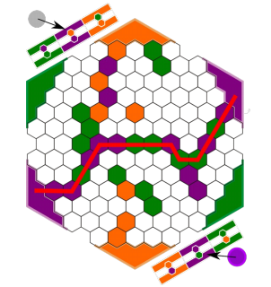
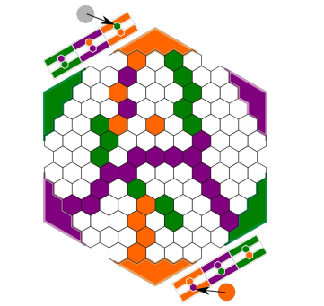
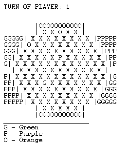
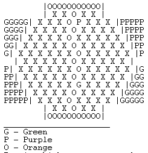

# TP1 PLOG - Alliances

## Group T2 Alliances_3

| Name                                      | Number    | E-Mail               |
| ----------------------------------------- | --------- | -------------------- |
| Adriana Cruz e Silva da Costa Gonçalves   | 201808911 | up201808911@fe.up.pt |
| José António Dantas Macedo                | 201705226 | up201705226@fe.up.pt |

---

## Game Description
Alliances, a 2-player game by Markus Hagenauer.
<br>
<br>
Alliances is a tricky game that requires you to connect opposite sides of
the board.
<br><br>
*The board has a shape of a 7x7 hexagon without the edges.*
<br>

<br>
<br>
To connect opposite sides of the board, 
each player must use the color matching the sides and form an
uninterrupted chain of discs between those sides.
<br> <br>
The chain of discs can also be formed by the allied colors, which is different for each player:
<br> <br>


### Game Components
1 gameboard, 42 green discs, 42 orange discs, 42 purple discs, 2 silver discs

### Gameplay
Every turn a player takes a disc from the supply and places it on any empty space on the board. <br>
If a connection is made between opposite sides,
with an uninterrupted chain of discs of the sides' color and/or the allied colour,
the player wins the color of the connected sides.
<br>


<br>

### Goal
Win 2 colors. A player wins a color by being the first to connect its two sides on the board or if a move makes it impossible for either player to connect a
particular color (by fencing it off), then the blocked player's opponent wins that color. 

<br><br>

You can find a more explanation
[here](./pdf/ALLIANCES_EN.pdf)
or find it online: 
<br>
https://nestorgames.com/rulebooks/ALLIANCES_EN.pdf;
<br>
https://boardgamegeek.com/boardgame/302399/alliances;
<br>
*gameplay video:*
https://www.youtube.com/watch?v=VNyHiCfOWhw&feature=emb_logo.

----
## Internal representation of the state of the game
<br>

The current state of the game is stored in a list of lists with differents lengths. <br>
The list represents the board, and the lists within that list represents the different rows of the board. <br>
The rows of the board have multiple atoms that represent the discs and the empty spaces of the board. <br>

Atoms meaning:

| Atom | Meaning                         |
| ---- | ------------------------------- |
|  X   | Empty space on the board        |
|  G   | Green Disc                      |
|  P   | Purple Disc                     |
|  O   | Orange Disc                     |

Current Player is represented by the variable 'Player'.
<br><br>
Exemple of representation of game states:
<br>

```
Example of initial board:
initial([
    [X,X,X,X,X],
    [X,X,X,X,X,X,X,X],
    [X,X,X,X,X,X,X,X,X],
    [X,X,X,X,X,X,X,X,X,X],
    [X,X,X,X,X,X,X,X,X,X,X],
    [X,X,X,X,X,X,X,X,X,X,X,X],
    [X,X,X,X,X,X,X,X,X,X,X],
    [X,X,X,X,X,X,X,X,X,X,X,X],
    [X,X,X,X,X,X,X,X,X,X,X],
    [X,X,X,X,X,X,X,X,X,X],
    [X,X,X,X,X,X,X,X,X],
    [X,X,X,X,X,X,X,X],
    [X,X,X,X,X]
]).
```

<br>

```
Example of intermediate board:
intermediate_board([
    [X,X,O,X,X],
    [X,X,X,O,X,X,X,X],
    [X,X,X,X,P,X,X,X,X],
    [X,X,X,X,P,X,X,X,X,X],
    [X,X,X,X,X,O,X,X,X,X,X],
    [X,X,X,X,X,O,X,X,X,X,X,X],
    [X,X,X,X,X,O,X,X,X,X,X],
    [X,X,X,X,G,X,X,X,X,X,X,X],
    [X,X,X,X,X,G,X,X,X,X,X],
    [X,X,X,X,O,G,X,X,X,X],
    [X,X,X,X,G,O,X,X,X],
    [X,X,X,X,O,X,X,X],
    [X,X,O,X,X]
]).
```

<br>

```
Example of final board:
final_board([
    [X,X,O,X,X],
    [X,X,X,O,X,X,X,X],
    [X,X,X,X,P,O,X,X,X],
    [X,X,X,X,P,O,X,X,X,X],
    [X,X,X,X,X,O,X,X,X,X,X],
    [X,X,X,X,X,O,X,X,X,X,X,X],
    [X,X,X,X,P,O,X,X,X,X,X],
    [X,X,X,P,G,X,X,X,X,X,X,X],
    [X,X,X,X,P,G,X,X,X,X,X],
    [X,X,X,X,O,G,X,X,X,X],
    [X,X,X,X,G,O,X,X,X],
    [X,X,X,X,O,X,X,X],
    [X,X,O,X,X]
]).
```

-----
## Visualizing the game
The predicate of the game state visualization was implemented by calling the predicate **initial** that returns the variable 'Board' with the initial game state (empty board).<br>
Then the predicate **random_select** selects a random player to start and returns the variable 'Player',
the predicate **display_game** is then called with the variables 'Board' and 'Player' and calls the predicate **display_board** that calls several predicates that will write the game state. <br>
Here's an example of the game state visualization:
<br>
*Emply Board of Alliances*
<br>


<br>
*Intermediate Board of Alliances*
<br>


<br>
*Final Board of Alliances*
<br>


