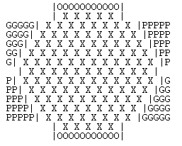

# TP1 PLOG - Alliances

## Group T2 Alliances_3

| Name                                      | Number    | E-Mail               |
| ----------------------------------------- | --------- | -------------------- |
| Adriana Cruz e Silva da Costa Gonçalves   | 201808911 | up201808911@fe.up.pt |
| José António Dantas Macedo                | 201705226 | up201705226@fe.up.pt |

---

## Game Description
Alliances, a 2-player game by Markus Hagenauer.
 
 
Alliances is a tricky game requires you to connect opposite sides of
the board.
To connect opposite sides of the board, each player must form an
uninterrupted chain of discs between those sides.
 

 
You can find a more explanation [here](./pdf/ALLIANCES_EN.pdf)
or find it online: 
 
https://nestorgames.com/rulebooks/ALLIANCES_EN.pdf;
 
https://boardgamegeek.com/boardgame/302399/alliances;
 
*gameplay video:*
https://www.youtube.com/watch?v=VNyHiCfOWhw&feature=emb_logo.
 

*Fig. 1: The Board of Alliances*

 
 

----
## Internal representation of the state of the game
 

The board is represented by a list of lists with differents lengths. To exemplify, it was created 3 boards:
an [initial board](./boards/InitialBoard.pl), 
an [intermediate board](./boards/InterBoard.pl)
and a [final board](./boards/finalBoard.pl). 
The first list describes the state of the game: the number of discs in the Gain and Risk areas of both players, and the number of discs that the players have. The rest of the lists describes the board. They vary in size.

To represent the discs and the differents spaces of the board, several atoms where used. The following table makes the correspondence between the atoms and their meaning:

| Atom | Meaning                         |
| ---- | ------------------------------- |
|  X   | Empty space on the board        |
|  G   | Green Disc                      |
|  P   | Purple Disc                     |
|  O   | Orange Disc                     |

 
-----
## Visualizing the game

 
 
